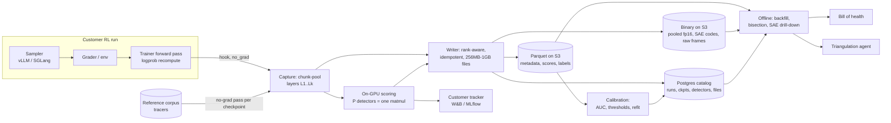

# Reward Monitoring System: End-to-End Design

**Status:** draft, 2026-10-05. Design for training-time monitoring of reward hacking and related behaviors during RL post-training, using activation probes and SAEs.

Tags used throughout:
- **[Decided]** converged in discussion
- **[Proposed]** recommendation, not yet validated
- **[Open]** needs input at the onsite (consolidated in §17)

## Contents
- [0. Bottom line](#0-bottom-line)
- [1. Problem and product](#1-problem-and-product)
- [2. Vocabulary](#2-vocabulary)
- [3. Architecture overview](#3-architecture-overview)
- [4. Detection waterfall](#4-detection-waterfall-decided)
- [5. Capture](#5-capture)
- [6. Labels](#6-labels)
- [7. Detectors](#7-detectors)
- [8. Calibration and drift](#8-calibration-and-drift)
- [9. Storage](#9-storage)
- [10. Online flow](#10-online-flow)
- [11. Offline flow](#11-offline-flow)
- [12. Bill of health](#12-bill-of-health)
- [13. Triangulation agent](#13-triangulation-agent)
- [14. Tenancy, security, retention](#14-tenancy-security-retention)
- [15. Risks and failure modes](#15-risks-and-failure-modes)
- [16. Roadmap](#16-roadmap-5-weeks-draft)
- [17. Open questions](#17-open-questions)
- [Appendix A. Sizing](#appendix-a-sizing)

---

## 0. Bottom line

- **What it is:** a training-time monitor for RL post-training on Baseten. It keeps a compact, replayable record of every run (tokens, chunk-pooled activations, detector scores) and turns it into a **live hack-rate signal** and a **per-environment, per-checkpoint bill of health**.
- **Core bet:** linear probes on mid-to-late residual stream catch reward hacking cheaply, **if they are refit per checkpoint against a fixed, labeled reference corpus**. Stored pooled activations make any future probe replayable over history as a matmul, **with no checkpoint reload**.
- **The hard parts are not detection.** They are (1) probe validity as weights move, (2) rollout-level labels, (3) integration into Baseten's trainer, (4) tenant isolation. The design answers 1 and 2. **3 and 4 depend on onsite answers.**
- **v1 is observe-only:** alerts, no auto-halt, nothing enters the gradient. **Probes are the critical path; SAEs come in week 3+.**
- **Six questions block the plan** (§17, top table): trainer hook access, LoRA vs full fine-tune, label provenance, tenancy model, checkpoint retention, and the week-5 success criterion.

---

## 1. Problem and product

### 1.1 Problem
During RL post-training, models learn undesirable behaviors: reward hacking (editing tests, special-casing the grader, hardcoding outputs), shortcut-taking, sycophancy, eval gaming, and obfuscation. Causes include grader loopholes, environment bugs, reward-model exploitation, and skew in the training data. **Most reward hacking traces to a grader loophole in one specific environment**, but a run mixes environments into one weight update, so one bad environment contaminates the whole model.

### 1.2 Who it is for
Baseten customers post-train open-weight models (SFT + RL via Loops) to build cheaper vertical agents (e.g., Harvey's M&A diligence agent). They need to know the model they ship is not gaming its training signal. Often **Baseten's embedded researchers** pull the levers, so the product has two readers: the customer (trust, sign-off) and the embedded team (debugging).

### 1.3 Product [Decided]
1. **Live signal** during the run, to avoid wasting compute on a run that went bad.
2. **Post-hoc bill of health** per training run: a checklist of tests, per environment and per checkpoint, with a scoped "clean" claim.
3. **Retroactive replay:** when a new behavior is discovered, score it over all stored history and find **where it started** (environment, run, checkpoint, rollout).
4. **Triangulation agent** (later): automates the debugging loop from "it hacks" to root cause.
5. **Track detector accuracy and hit rates** across runs, customers, and (later) deployments.

### 1.4 Behavior classes [Decided]
| Class | Examples | Who defines | Ships as |
|---|---|---|---|
| **Generic, transferable** | Test/grader tampering, sycophancy, deception, eval awareness, sandbagging | Goodfire | Standard detector panel, comparable across customers |
| **Corpus-specific** | Citing clauses absent from the data room; claiming coverage of skipped files; gaming one rubric term | Customer or embedded team, from a few flagged examples | Per-tenant detectors, comparable across that tenant's runs |

### 1.5 Levers customers have once something is flagged
| Lever | Fix | Fits |
|---|---|---|
| Environment / grader | Patch the loophole, add rubric terms, asymmetric reward | Reward hacking (the main one) |
| Mixture weights | Down-weight or drop the offending environment | One bad environment in a mix |
| Data | Filter flagged trajectories | Contaminated SFT or rollouts |
| Run control | Halt, roll back, tune KL/LR | Mid-run emergence |
| Checkpoint selection | Ship step N, not N+k | Late drift |

**Asymmetric reward beats 0/1:** a 0/1 grader pays a hack the same as a clean solve. Clean pass +1, clean fail 0, detected hack -α with α > 1 makes hacking a losing bet.

### 1.6 Scope and non-goals (v1)
- **In:** training-time monitoring of RL runs (GRPO first), Loops-managed runs first.
- **Out:** serving-time monitoring (phase 2), auto-halt (needs a measured false-positive rate first), using detectors in the reward (see §8.5), Training Jobs (bring-your-own-container) path.

---

## 2. Vocabulary

| Term | Meaning |
|---|---|
| **Run** | One training job from a base model to a set of checkpoints. Hours to days |
| **Step** | One policy update: sample a batch, grade, update weights. Use "step," not "turn" |
| **Checkpoint** | Saved weights, every N steps. The unit we bisect over |
| **Rollout** | One attempt at one prompt in one environment, graded. 1K to 30K+ tokens in agentic setups |
| **Turn** | One model/environment exchange *inside* a rollout |
| **GRPO group** | The sibling rollouts sampled from one prompt. Advantage = reward minus group mean |
| **Environment** | Tasks + harness (tools, sandbox) + grader |
| **Chunk** | Fixed token window (proposed 256 tokens, aligned to tool-call boundaries where possible) |
| **Detector** | A probe direction or an SAE feature; anything that maps activations to a score |
| **On-policy** | Sequences sampled by the current checkpoint (live rollouts; real customer data) |
| **Off-policy / reference corpus / tracers** | Fixed labeled sequences the current model did not generate; pushed through every checkpoint |
| **Replay** | Forward pass over stored tokens on a retained checkpoint (prefill / teacher forcing). Deterministic up to floating-point noise |

**Typical scale (used in the sizing appendix):** 1,000 steps x 256 rollouts = **~256K rollouts per run**.

---

## 3. Architecture overview



**Six planes:**
1. **Capture**: hooks in the trainer, pooling, rank-aware writes (§5).
2. **Label**: programmatic, judge, human (§6).
3. **Detect**: probes and SAEs, the detection waterfall (§4, §7).
4. **Calibrate**: reference corpus, drift checks, per-checkpoint refit (§8).
5. **Store**: catalog + Parquet + binary, coverage, retention (§9).
6. **Consume**: live alerts, offline replay, bill of health, agent (§10 to §13).

---

## 4. Detection waterfall [Decided]

Free signals score every rollout; each tier down costs more and sees fewer rollouts; **labels from the bottom retrain the top**. Same shape as ads fraud: cheap high-recall filter, expensive high-precision confirmer, human review on disagreement.

| Tier | Signal | Coverage | Cost | Needs stored |
|---|---|---|---|---|
| **0. Environment** | Reward jump, length shift, reward up while held-out eval flat, visible-pass + hidden-fail, test-file diffs | Every rollout | Free | Metadata, reward components |
| **1. Targeted directions** | k known directions as dot products, (batch, d) x (d, k) | Every rollout | ~Free, on GPU | Scores |
| **2. Full-vector probe** | Linear probe on the whole vector; catches many weak features firing together | Every rollout | Cheap | Pooled activations |
| **3. LLM judge** | Transcript review against a behavior spec | Escalations + audit sample | $$ per rollout | Tokens, judge labels |
| **4. Offline decomposition** | SAE features, clustering; finds behaviors nobody labeled | Between checkpoints, stored data | GPU-hours | Per-token residuals (compressed), raw frames on spikes |

**Why tier 4 exists:** supervised probes only find hacks someone labeled. Tier 4 surfaces new ones, which become tier 1/2 probes. **The loop is the product.**

---

## 5. Capture

### 5.1 Hook location [Decided]
**Hook the trainer's forward pass (the logprob recompute), not the inference engine.**
- Every rollout already passes through a plain PyTorch forward in the trainer, because the policy update needs differentiable logprobs. Hooking it is near-free.
- Inference engines resist hooks: CUDA graphs (Python hooks do not fire on replay), fused residual+layernorm kernels, continuous batching (flat token lists), prefix caching (shared prefixes never recomputed), separate TP worker processes.
- **Labels exist only at the trainer.** At sampling time the rollout is not graded yet; at `forward_backward` the label, reward, environment, and group travel with the batch.
- Hook under `no_grad` on a detached copy; this forward pass builds the gradient graph.
- **Cost:** in async RL the trainer's weights may be a step ahead of the sampler's. Fine for monitoring; the existing trainer/sampler logprob-disagreement metric bounds the gap.

**Talking point:** *at training time, capture is easy and interpretation is hard because the model moves every step; at inference time, interpretation is stable and capture fights the serving engine.*

**Loops-specific consequence [Open]:** in Loops the RL loop runs in customer code, which calls `sample()`, computes advantages, and calls `forward_backward()` / `optim_step()` against Baseten's managed trainer. So:
- **Activation capture lives in Baseten's trainer**: an integration with Baseten, not the customer.
- **Rollout metadata lives in customer code**: environment, reward components, and grouping need a thin client wrapper (or a Loops callback Baseten ships).

### 5.2 Sharding decides who writes [Decided]
| Strategy | Where the residual lives | Capture rule |
|---|---|---|
| **FSDP / data parallel** | Each rank has full activations for its own rollouts | Every rank writes its own slice. Easy case; most mid-size runs |
| **Tensor parallel** | Replicated on every TP rank after all-reduce | Write from one TP rank only |
| **TP + sequence parallel** | Each rank holds a token slice | Write slices or gather; align chunk boundaries to the split |
| **Pipeline parallel** | Layer lives on one stage | Hook only the stage that owns the target layer |

Writer requirements: rank-aware (knows its DP/TP/PP coordinates), maps tokens back to rollout IDs, ships probe vectors to the stage that owns each layer.

### 5.3 What is captured per rollout
| Artifact | Granularity | Always? |
|---|---|---|
| Tokens (prompt + completion) | Per token | **Always** (~4 B/token, ~4,000x smaller than one layer of activations) |
| Metadata: tenant, run, step, checkpoint, rollout, GRPO group, environment, prompt, reward + components, advantage, length | Per rollout | **Always** |
| Chunk-pooled mean activations, k layers | Per chunk per layer | **Always** (the probe substrate) |
| Detector scores | Per chunk per detector | **Always** |
| Compression-SAE codes (top-k index + value) | Per token per layer | Sampled, or always if budget allows (§9.6) |
| Feature-SAE activations | Per token, sparse | Week 3+ |
| Raw residual frames | Per token per layer | Only on high SAE reconstruction error or alert |

### 5.4 Layers and pooling [Proposed]
- **Layers:** the hacking signal sits around **60-75% depth** in published work; never hardcode. Sweep all layers on the first instrumented run, pick 2-4 by held-out AUROC, freeze them in a `pooling_config`. Re-check the choice per model family.
- **Pooling:** mean over fixed chunks of assistant-generated tokens only (tool outputs and data-room text are input, not behavior). Align chunk boundaries to tool calls where possible.
- **Scoring a rollout:** max or top-k over chunk scores, **not the mean**. A hack lives in a few chunks; averaging over a 30K-token rollout dilutes it.
- **Exactness rule:** layers, chunk size, boundaries, and pooling op must match exactly between fit and apply. Stored in `pooling_configs`, referenced by every file and detector version.
- **GRPO prefix sharing:** siblings share the prompt, so prompt-chunk pools are computed and stored once per group.

---

## 6. Labels

### 6.1 The label-noise problem [Decided]
Environment-level labels ("this came from an impossible task") are not rollout-level behavior. An impossible task can produce an **honest failure**. Random label noise weakens a probe; **systematic** noise (a judge that always misses one hack type) steers it away from that type.

### 6.2 Source hierarchy [Decided]
1. **Programmatic ground truth (preferred):** visible tests pass + hidden tests fail, test files modified, outputs hardcoded, grader special-cased. Built into every synthetic environment as label hooks.
2. **LLM judge (fallback):** for hacks with no programmatic trace (subtle shortcuts, misleading explanations).
3. **Hand labels (validation):** a few hundred per behavior as a golden set to measure judge precision/recall.

**Off-policy labels train detectors; on-policy labels (env signals where available, sampled judge checks) validate them.**

### 6.3 Span labels
Programmatic checks know *where* the hack happened (the tool call that edited the test). Store the token span; **fit on chunks inside the span**, not the whole rollout.

### 6.4 Assumption [Open]
**Assumes labeled data exists from prior Goodfire experiments** (e.g., Prime Intellect environments). Confirm source, granularity, and quality. If not, the labeling pipeline is a week-1 build, and probe quality cannot exceed label quality.

---

## 7. Detectors

### 7.1 Probe types: stay linear [Decided]
| Probe | Fit | Role |
|---|---|---|
| **Difference of means** v = mean(hack) - mean(clean) | Two running sums per class | **Default.** Robust out of distribution; refit nearly free |
| **Logistic regression** | Seconds | Fallback if diff-of-means AUC is weak |
| **LDA** (whitened diff-of-means) | Needs d x d covariance | Optional; sharper but 8192² per layer |
| **Sparse probe on SAE features** | Seconds | Interpretability: names which features fire |
| **MLP / random forest** | Minutes+ | **Research baseline only** |

**Why linear only:** nonlinear probes can learn the concept themselves (the AUC describes the probe, not the model), and they break the cheap path: no single direction means no matmul backfill, no cosine drift metric, no steering later.

### 7.2 Fitting mechanics [Proposed]
- **On GPU, inside the hook:** accumulate per-class sums `[P, 2, d]` plus counts; P probes cost about one until P is in the thousands.
- **LR variant:** multi-label, independent sigmoid per probe, **masked loss** (a missing label means no gradient, not negative), per-probe positive weighting.
- **Confound control:** subtract per-environment means; balance classes within environment. Otherwise v partly encodes "hard environment" or "late checkpoint."
- **Negatives** from the same environment and step range as positives.
- **Known transfer limit:** probes fit on SFT-induced hacking did not transfer to GRPO-induced hacking in published work (near-zero cosine). Fit on the regime you monitor.

### 7.3 SAEs (week 3+)
Two roles, both on per-token residuals:
| SAE | Width | Purpose |
|---|---|---|
| **Compression SAE** | Overcomplete, top-k | Store per-token residuals cheaply; reconstruct for SAE reads and drill-down |
| **Feature SAE** | Narrower | Interpretable features for discovery (tier 4) and drill-down |

**SAEs cannot read pooled activations:** SAE(mean) ≠ mean(SAE). This asymmetry is why the compression SAE exists. Probes run on cheap pooled storage; SAEs need the per-token path: decompress, raw frames, or replay.

Note: features computed on reconstructed activations inherit the compression SAE's error.

### 7.4 BSF [Open]
"BSF features" is referenced in earlier drafts but never defined. **Define it on first use or cut it.** Research question carried over: do BSF subspaces capture weak multi-feature patterns that an SAE shatters into separate latents?

---

## 8. Calibration and drift

**Principle [Decided]:** a probe is a checkpoint-scoped artifact, not a fixed rule. **The labeled reference set is constant; the probe is refit per checkpoint against it; each probe reads only data from its own checkpoint.** This is recalibrating an instrument against a reference sample, not blending old and new probes.

### 8.1 Reference corpus [Decided]
- **Contents:** labeled positives and negatives per behavior; hacks harvested from other runs as they are found. **Small, curated, fixed.** (Broad unlabeled coverage was dropped: on-policy storage already provides it.)
- **Why on-policy is not enough:** (1) before onset there are no positives at that checkpoint; (2) on-policy data changes with the policy, so it cannot isolate representation change.
- **Two layers:** a shared synthetic base (Goodfire environments) plus a per-tenant extension (never crosses tenants; §14).
- **Tracer pass:** pushed through every checkpoint in a **separate no-grad pass, never in the training batch** (or the eval set leaks into the policy).
- **Always persist its pooled activations:** ~6 GB per checkpoint at d=8192 (2K sequences x 64 chunks x 3 layers), vs ~140 GB for a 70B checkpoint.

### 8.2 Drift decision table [Decided]
| Live on-policy score | Tracer AUC / calibration | Meaning | Action |
|---|---|---|---|
| Rising | Stable | Model hacks more | **Alert** |
| Rising | Negatives also rising | Representation drift inflates everything | **Recalibrate threshold**, no alert |
| Falling | Stable | Model stopped hacking | Nothing |
| Falling | AUC dropping | Probe went blind (possible obfuscation) | **Refit**; never read as a fix |

Cross-check with tier 0:
| Env hack rate (visible pass, hidden fail) | Probe hack rate | Read |
|---|---|---|
| Rising | Rising | Learning to hack |
| Flat | Rising | Probe drifting; refit |
| Rising | Flat | Probe missing hacks; refit or add probe |
| Falling | Falling, AUROC falling | **Obfuscation, not a fix** |

**Free drift metric:** cosine(v_k, v_k+1) between consecutive diff-of-means directions. Slow rotation is normal; a sharp drop predicts transfer failure.

**Off-policy caveat:** tracers are sequences the current model may no longer produce. A probe can keep separating old tracers while missing a new way of hacking. **Pair tracer AUC with a sampled on-policy judge check.**

### 8.3 Normalization [Decided]
Raw scores differ in scale across probes, SAE features, and probe versions. Two normalizations, two uses:
- **Alerting:** percentile vs that checkpoint's tracer negatives. Threshold at **1% FPR on reference negatives** makes "above threshold" directly interpretable.
- **Display:** median-anchored scale, **0 = median clean, 1 = median bad** (medians, not min/max, so one outlier cannot stretch the scale).

**Versioning:** scores from probe v1 and v2 are not on one scale. Every score row carries `detector_version_id`; time series break at refits unless reported in percentile units.

### 8.4 SAE drift [Proposed]
- **Transfer test per checkpoint:** reconstruction error / explained variance, plus hacking-feature behavior on reference samples. Good reconstruction does not guarantee features kept their meaning.
- **If it fails, fine-tune warm-started** on that checkpoint's (mostly on-policy) activations, mixing in some reference data; validate on off-policy labels.
- **Encoder-only by default:** decoder directions stay fixed, so feature #4117 still means what its label says and historical comparisons stay valid. Biases-only is the cheaper first try; full fine-tune only with per-feature decoder-cosine checks.
- **Track compression-SAE reconstruction error per checkpoint as its own drift metric.** Expect the raw-frame fallback to fire more on late checkpoints.

**Shared skeleton:** probes and SAEs run one loop (fit on checkpoint, validate on off-policy labels, refit on drift). Build it for probes in weeks 1-2; SAEs plug in later.

### 8.5 Monitor vs gradient [Decided]
| Placement | Flagged rollout | Pressure on model | Failure mode |
|---|---|---|---|
| **Observe (v1)** | Scored, dashboarded, run halted by a human on spike | None | Probe goes stale (maintenance) |
| Filter | Dropped from GRPO group | Selection only | Weak teaching signal |
| Penalize | Score enters reward | Strongest | **Obfuscated policy** |

- **Product boundary:** sell the monitor; the customer owns the action policy. A read-only sidecar cannot be gamed by gradient descent.
- **If a customer ever uses a probe in the reward:** keep a held-out probe family that never touches the loss. Shaping probe says clean while held-out says dirty: stop the run.

---

## 9. Storage

### 9.1 The rule [Decided]
**If it is looked up in SQL, it goes in Parquet. If it must pass through a matmul or GPU to mean anything, it goes in binary.** A small transactional catalog knows what exists and where.

| Store | Holds | Tech |
|---|---|---|
| **Catalog** | Runs, checkpoints, files, detectors, versions, SAEs, coverage, jobs | Postgres |
| **Tables** | Rollout metadata, scores, labels, calibration, pointers into binary | Parquet on S3 as Iceberg/Hive-style tables; DuckDB for single runs, Presto/Spark for history |
| **Payload** | Pooled vectors, SAE codes, raw frames | safetensors / npy, fp16 contiguous arrays, memory-mappable |
| **Live metrics** | Hack-rate curves | Customer tracker (W&B/MLflow); ClickHouse later if query volume grows |

Reuse standard lakehouse patterns. **Novelty is concentrated in the activation-specific index, coverage, and replay logic**, not in storage.

Alternative worth evaluating: **Lance** stores vectors and metadata together with random access, collapsing the offset index into one format.

### 9.2 Layout and file policy [Decided]
- **Partition by tenant / run / checkpoint; sort or cluster by GRPO group** inside a partition. Group ID or rollout ID as partition keys creates millions of tiny partitions.
- **Roll files at 256 MB to 1 GB**, not 10 GB: limits loss on node failure and parallelizes scans.
- **Idempotent writes** keyed by (run, rollout, chunk, layer), so retries and preempted jobs neither duplicate nor drop rows.
- **No pickle.** safetensors or npy.
- **Per-layer contiguous arrays** so a scan reads only the layers it needs.
- Path shape: `s3://<bucket>/<tenant>/<run>/<checkpoint>/<kind>/<shard>.safetensors`, one KMS key per tenant.

### 9.3 Catalog schema (Postgres) [Proposed]
```
tenants              (tenant_id, isolation_tier, kms_key_id)
runs                 (run_id, tenant_id, base_model, adapter_type {lora|full}, framework,
                      env_mix, config_uri, status)
checkpoints          (checkpoint_id, run_id, step, uri, retained bool, retention_reason)
environments         (env_id, tenant_id, name, grader_version, label_hooks)
pooling_configs      (pooling_config_id, layers, chunk_size, boundary_rule, pool_op, dtype)
files                (file_id, tenant_id, run_id, checkpoint_id, kind, uri, bytes, rows,
                      pooling_config_id, lineage)
detectors            (detector_id, kind {dom|lr|sae_feature}, behavior, layer,
                      role {monitor|shaping}, scope {shared|tenant}, tenant_id,
                      status {speculative|verified|canonical})
detector_versions    (detector_version_id, detector_id, checkpoint_id, weights_uri,
                      label_version, pooling_config_id, auc, thr_fpr1,
                      median_neg, median_pos, cos_prev)
saes                 (sae_id, role {compression|feature}, layer, width, k, parent_sae_id,
                      finetune_variant, checkpoint_id, recon_error)
reference_samples    (sample_id, scope {shared|tenant}, tenant_id, token_uri, token_hash, source)
reference_activations(sample_id, checkpoint_id, layer, shard_uri, offset)
jobs                 (job_id, kind, inputs, status, cost_estimate, approved_by)
```
`detector_versions` doubles as the evidence trail: probes are catalog claims (speculative / verified / canonical), validation rows are the evidence.

### 9.4 Parquet tables [Proposed]
```
rollouts   (tenant_id, run_id, checkpoint_id, step, rollout_id, grpo_group_id, env_id,
            prompt_id, reward, reward_components, advantage, n_tokens,
            token_uri, pooled_uri, pooled_offset, sae_uri, raw_uri, flags)
scores     (detector_version_id, rollout_id, chunk_idx, raw_score, pct_vs_neg)
labels     (sample_id|rollout_id, behavior, label, span_start, span_end,
            source {programmatic|judge|human}, confidence, label_version)
calibration(checkpoint_id, detector_version_id, auc, neg_p99, pos_median, recon_error)
```
Labels are a table, not a column: one sample carries several behaviors and sources. **A relabel or judge upgrade triggers a refit**, and old scores stay traceable through `label_version`.

### 9.5 Coverage and the cost planner [Decided for v1 rule; planner is future work]
For any (sample, checkpoint), one left join against `reference_activations` decides the path:
- **Row found** -> read stored residuals.
- **No row, checkpoint retained** -> schedule a replay.
- **No row, not retained** -> unrecoverable; skip and report the gap.

The same query **estimates cost (bytes, GPU-hours) before a bisection runs.** Long term this is a query planner choosing between a materialized view (stored) and recompute (replay), with materialization and eviction policies driven by what queries actually hit.

### 9.6 Retention policy [Proposed]
| Artifact | Size | Policy |
|---|---|---|
| Tokens + metadata | ~16 GB/run | **Always** |
| Scores, AUC, calibration, recon error | KB to MB | **Always** |
| Reference-corpus pooled activations | ~6 GB/checkpoint | **Always** |
| On-policy pooled activations | ~0.8 TB/run (d=8192) | **Always** (v1); tier to cold after N days [Open] |
| Compression-SAE codes | ~4.8 TB/run if all rollouts | **Sample** (e.g., 10%) plus all flagged rollouts |
| Checkpoints | ~100 MB (LoRA) to ~140 GB (70B full) | LoRA: **keep all**. Full: **every Nth + alert-flagged** |
| Raw frames | ~65 TB/layer/run if all | **Only** on high recon error or alert |

**Checkpoint retention bounds how precisely onset can be located** for anything outside the reference corpus. If Loops RL is LoRA throughout, keep every adapter and the problem disappears.

---

## 10. Online flow

1. **Run start:** register run, environments, pooling config, active detector versions in the catalog. Ship probe vectors (~16 KB each) to the trainer ranks that own each layer.
2. **Each step, in the trainer forward pass** (hook, no_grad): pool chunks at the configured layers; score P detectors in one matmul on a separate CUDA stream; append pooled vectors and scores to a ring buffer.
3. **Rollout group complete:** the rank-aware writer flushes metadata + scores to Parquet and pooled vectors (+ sampled SAE codes, raw frames on spikes) to binary; registers files in the catalog.
4. **Each checkpoint:** tracer pass over the reference corpus (no grad); store its pooled activations; compute AUC, thresholds, medians, cosine to previous direction; apply the drift table (§8.2): keep, recalibrate, or refit and version.
5. **Push live curves to the customer's tracker:** hack rate per behavior per environment (percent of rollouts above the 1%-FPR threshold), next to reward, KL, and length.
6. **Alert** when hack rate rises with stable tracer AUC, or on tier-0 signals (reward up, eval flat). **Core alert:** reward rising while the hack probe rises. **Second:** probe vs judge disagreement.
7. **Escalate** top-scoring rollouts to the LLM judge (tier 3); write judge labels back to `labels`.
8. **Human decides** to halt, roll back, reweight, or continue. **v1 never acts on the run automatically.**

**Detection lag:** about one step behind generation. Fine for monitoring.

---

## 11. Offline flow

### 11.1 Backfill a new detector over history
1. **Get labels:** label existing reference samples for the new behavior, add new samples, or label stored on-policy rollouts with the judge (useful late in a run; few positives before onset).
2. **Transfer test first:** score a few old checkpoints' tracers with the newest probe. **If AUC holds, one probe serves the whole run**; skip refitting.
3. **Otherwise fit per checkpoint:** stored residuals if the sample existed at that checkpoint, replay on a retained checkpoint if it did not (§9.5).
4. **Score:** SQL selects rows, a Ray/Spark job loads pooled shards and runs one matmul for all P probes. **CPU is fine; the job is I/O-bound** (~0.8 TB per run, ~15 min on one node at 1 GB/s, minutes on a cluster).
5. **Write** scores with the new `detector_version_id`.

### 11.2 Find onset (bisection) [Decided]
For each checkpoint visited:
- Fit a probe on labeled off-policy samples at that checkpoint (stored if present, replay if not).
- Threshold at 1% FPR on that checkpoint's off-policy negatives.
- Score that checkpoint's **on-policy** pooled activations; report % of rollouts above threshold.
- **Coarse sweep first** (every ~50th checkpoint) to guard against non-monotonic onset, then bisect inside the first rising window. ~10 sweep fits + a few bisection fits instead of 1,000.

**Backstop with no probes:** judge or rule checks over stored tokens give the **behavioral** onset. Probes add the product claim: **did the latent signal rise before the behavior appeared?**

**Attribution across environments:** compare onset per environment. The environment where scores rose first is the likely source; one firing elsewhere may be generalization.

### 11.3 SAE drill-down
Decompress per-token residuals (or swap in raw frames, or replay), run the feature SAE after its per-checkpoint transfer test, read which features fired in the top chunks. Turns "probe fired" into "these features fired here."

---

## 12. Bill of health

**The scoped claim [Decided]:** *"No detected deviation across N behaviors x M environments x K checkpoints, at a 1% false-positive rate calibrated on the reference set."* Clean means clean **for what was checked**; probes only cover known behaviors.

**Structure (drill-down):** summary -> per environment -> per checkpoint -> per-detector curves, all as hack rate vs the reference set.

| Row | Content |
|---|---|
| Behavior x environment | Pass/flag, peak hack rate, onset checkpoint if flagged |
| Evidence for a red row | Top-scoring chunks, transcripts, onset curve, GRPO contrast, judge verdicts |
| Detector health | Tracer AUC per checkpoint, refits, SAE recon error |
| Coverage | Checkpoints scored, rollouts scored, gaps (unrecoverable) |

**Delivery:** live per checkpoint as curves in the customer's tracker; full drill-down in a Goodfire-hosted view (if contracts allow).

---

## 13. Triangulation agent

### 13.1 Triangulation: three independent signals [Decided]
| Signal | Question |
|---|---|
| **Detector response** | Did the model represent hacking internally? |
| **Behavior** (text, judge, rules) | Did it observably hack? |
| **Reward / advantage** vs GRPO siblings | Did the grader pay for it? |

| Pattern | Read |
|---|---|
| All three high | **Grader bug being reinforced. Most urgent** |
| Detector + behavior high, reward low | Tried, grader caught it. Watch |
| Detector high, behavior low | **Early warning**: latent intent, no visible hack yet |
| Reward high, detector + behavior low | Legitimate success |

**GRPO contrast is free matched pairs:** same prompt, some siblings hacked, some did not. If the hacking sibling earned above-group reward, it got positive advantage and was **actively reinforced**.

### 13.2 Toolset
**From the database:** (1) score history, (2) fit detectors per checkpoint, (3) live monitoring, (4) slice and aggregate in SQL by environment, checkpoint, group, reward, (5) find onset, (6) read evidence (transcripts, top chunks), (7) drill down to per-token / SAE features, (8) GRPO contrast, (9) normalize, (10) **plan cost**.
**Alongside:** (11) LLM judge, (12) reward correlation, (13) read environment and grader code.

### 13.3 Flow ("customer says it started hacking")
0. **Match** the customer's examples to an existing detector, or confirm with the judge, fit a new detector, and backfill. (New behavior is the likely case.)
1. **SQL:** aggregate scores by run and environment.
2. **Onset:** sweep + bisect; run the cost planner first.
3. **Sample:** top-scoring rollouts and chunks at onset, plus GRPO siblings. (Scores are stored; no rerun.)
4. **Triangulate** per rollout (§13.1).
5. **Hypothesize** the mechanism; read grader code to confirm the loophole.
6. **Generalize:** fit a detector from confirmed examples; score other environments and runs.
7. **Report:** root cause, onset, evidence links, recommended action. **A human approves any action** on the customer's run.

**Loop rules:** escalate cost only on evidence (SQL before refit, refit before replay); no GPU spend above a budget without a cost estimate and human approval; stop when the hypothesis holds on matched pairs or the budget runs out.

**v0 for the 5 weeks:** a runbook the agent executes for the most mechanical, most frequent steps a researcher actually takes (§17, agent question).

---

## 14. Tenancy, security, retention

### 14.1 Isolation [Open: inherit Baseten's]
| Tier | Mechanism | Fits |
|---|---|---|
| Logical | Per-tenant prefixes, IAM, tenant ID on every row | Shared infra |
| Physical | Separate buckets, per-tenant KMS keys, separate compute | Enterprise |
| In customer VPC | Pipeline runs where training runs | Strictest; plausible default |

### 14.2 Cross-tenant learning [Proposed]
**Bring home the behavior, not the data.**
| What comes home | Leakage risk |
|---|---|
| Behavior pattern rebuilt as a Goodfire synthetic environment (FDE writes a description) | Near zero. **Default** |
| Synthetic samples generated from customer data | Moderate; needs n-gram overlap and secret/PII scans |
| Probe vectors fit on customer data | Low, nonzero; negotiable |
| Raw tokens, activations (partially invertible to text), checkpoints | **Never** |

Shareable: detectors and SAEs trained on Goodfire synthetic data; aggregate metrics (AUC, hit rates) with minimum-count thresholds. Tenant-only: everything fit on or harvested from customer data.

### 14.3 Build now vs defer [Decided]
- **Build now** (expensive to retrofit): tenant ID + run ID on every artifact; per-tenant prefix and key (crypto-shredding becomes free); lineage on every derived artifact so deletes cascade.
- **Defer:** deletion APIs, TTL policies, hot/cold tiering. Manual runbook for the pilot.
- **Trade-off to state openly:** deleting history removes the ability to backfill new detectors over it.
- **Access:** least privilege for researchers and the agent, audit logs, customer approval.

### 14.4 Monitor placement
Run scoring storage and alerting on infrastructure separate from the training workload where possible. A compromised training process can disable an in-process monitor; the trainer hook should be a dumb emitter, with judgment downstream.

---

## 15. Risks and failure modes

| Risk | Effect | Mitigation |
|---|---|---|
| **Probes do not hold AUC after refit** | Core bet fails | Week-2 go/no-go on a planted-hack run |
| Label noise (env-level labels) | Weak or biased probes | Programmatic labels, span labels, judge golden set |
| Confounds | Probe encodes environment or step | Per-environment mean subtraction, in-env balancing |
| Pooling dilution | Missed short hacks | Fit on span chunks; score by max/top-k |
| Off-policy blind spot | New hack style missed | Sampled on-policy judge checks; tier 4 discovery |
| Obfuscation | Signal hides | Observe-only; never in the reward; refit per checkpoint |
| Trainer/sampler weight lag (async RL) | Slightly stale activations | Bound with logprob disagreement metric |
| Storage blowup | Cost | Pooled default, sampled SAE codes, raw on spikes only |
| Integration friction with Baseten trainer | Live path slips | Fallback: offline-only v1 from checkpoints + transcripts |
| Cross-tenant leakage | Contract breach | §14 rules, lineage, per-tenant keys |
| Writer data loss / duplication | Gaps in history | 256 MB-1 GB rolls, idempotent keys, catalog reconciliation |

---

## 16. Roadmap (5 weeks, draft)

**Week-5 demo:** on a run with a planted grader loophole, the live hack-rate curve alerts at step X; the system finds the onset checkpoint and source environment; top chunks and GRPO contrast show the mechanism; a bill of health renders with the scoped claim.

| Week | Build | Exit criteria / metrics | HC |
|---|---|---|---|
| **0** (prework) | Access, Baseten stack walkthrough, data permissions; pick planted-hack testbed (e.g., coding env with editable tests); confirm label source | Answers to §17 blockers | 1 eng |
| **1** | Capture MVP on one run: metadata wrapper, trainer hook, pooled writer, catalog, tokens; diff-of-means probes from existing labels; one manual offline diagnostic | One run fully captured; **golden test: replayed pooled activations match live**; measured bytes/rollout and step overhead; probes reproduce known ROC on synthetic data | 2 infra eng (plumbing + customer integration), 1 researcher (consult, compression) |
| **2** | Calibration loop: reference corpus tracer pass, per-checkpoint refit, percentile normalization, drift table; offline backfill + bisection on testbed; start judge golden set | **Go/no-go:** tracer AUC holds after per-checkpoint refit at every retained checkpoint (target [Open], e.g. ≥0.9); probe onset at or before behavioral onset | 1 integration eng, 1 researcher |
| **3** | Live path: on-GPU scoring, tracker push, alert rules; roll out to a fraction of customer rollouts; compression SAE experiments | Step overhead under target [Open]; storage growth on plan; codec judged by **probe AUC on reconstructed activations** plus normalized KL | Same |
| **4** | Bill of health v1; agent v0 (onset + evidence + GRPO contrast, human approves); feature-SAE drill-down if compression passes | Bill of health on testbed and one customer run; agent reproduces a manual diagnosis | + researcher on SAEs |
| **5** | Hardening, one real customer run, demo | Demo above; alert precision measured against judge | Full team |

**Cut line, in order:** feature SAE -> compression SAE -> agent automation (keep the runbook) -> live alerting (keep offline). **Never cut:** capture + catalog, calibration loop.

**Biggest schedule risk:** if Baseten cannot expose a trainer hook in the pilot, weeks 2-3 become the whole v1 (offline from checkpoints + transcripts) and live monitoring moves to v2.

---

## 17. Open questions

### 17.1 Blocking (answer at the onsite)
| # | Question | Decides |
|---|---|---|
| B1 | Can we hook Baseten's trainer forward pass in Loops, or do we only get checkpoints and transcripts afterward? | Whether live monitoring is in v1 |
| B2 | Is Loops RL LoRA throughout, or full fine-tunes too? | Checkpoint retention cost, replay cost |
| B3 | How were labels produced in prior Goodfire experiments (programmatic, judge, hand)? Rollout- or span-level? Quality measured how? Is there a golden set? | Whether labeling is a week-1 build |
| B4 | Where does the pipeline run (Baseten infra, customer VPC, Goodfire) and what isolation does Baseten provide? | Storage and access architecture |
| B5 | Current checkpoint retention policy? | Onset precision outside the reference corpus |
| B6 | What does success look like at week 5, in one sentence with a number? | Roadmap headline |

### 17.2 Infrastructure and integration
- Which RL framework do Baseten and its customers run (verl, TRL, OpenRLHF, in-house)?
- Sync or async RL? How large is the trainer/sampler weight lag?
- How is the trainer sharded (FSDP, TP, sequence parallel, PP), per supported model?
- Has Goodfire already hooked a trainer forward pass? Which layers, what overhead?
- Which tracker do customers use (W&B, MLflow)? Is a Goodfire-hosted view allowed?
- Acceptable latency overhead per RL step?
- Will Baseten ship the metadata wrapper as a Loops callback, or do customers add it?

### 17.3 Labels, detectors, research
- Does Goodfire have a hack taxonomy or environment library that FDE findings feed into?
- How far does a base-model probe survive post-training drift before refit (LoRA vs full)?
- Do generic probes transfer across fine-tunes of the same base model (Qwen, GLM)?
- Does a compression config keep probe AUROC, not just normalized KL?
- Cross-model transfer (fit on large, monitor a small sibling): research, not default.
- What is BSF? Do BSF subspaces capture weak multi-feature patterns SAEs shatter?
- Which judge model, at what sampling rate and cost?
- Chunk size: fixed 256 vs tool-call aligned; does it change AUC?

### 17.4 Tenancy, contracts, retention
- What can Goodfire aggregate or reuse across customers (metrics, behavior patterns, probes)?
- What retention do customers expect? Does the DPA require a deletion SLA from day one?
- Who at Goodfire may query customer activations, and with what approval?
- Who pays for storage, and what is the per-run budget?

### 17.5 Product and scope
- Who reads the bill of health first: customer, or Baseten's embedded researchers? Who acts on an alert?
- Does any customer want detectors in the reward (filter/penalize)? If so, held-out family required.
- Is serving-time monitoring on Baseten's roadmap, and on which engine? (Phase 2: needs vLLM/SGLang patching or an interp integration such as nnsight.)
- How does a customer define a corpus-specific behavior: flagged examples, a written spec, or both?

### 17.6 Agent
- **"Walk me through how a researcher debugged the last reward hack you found."** Map each step to §13.2; unmapped steps are missing capabilities or the parts that stay human. The most frequent, most mechanical steps are agent v0.

---

## Appendix A. Sizing

**Assumptions:** 256K rollouts/run (1,000 steps x 256), 16K tokens/rollout avg, 256-token chunks (64/rollout), 3 layers, fp16, d=8192 (70B-class; scale by 0.625 for d=5120). Estimates; replace with week-1 measurements.

| Artifact | Per rollout | Per run |
|---|---|---|
| Tokens | 64 KB | ~16 GB |
| Pooled activations (64 x 3 x 16 KB) | ~3 MB | **~0.8 TB** |
| Compression-SAE codes (k=64, int32 idx + fp16 val = 384 B/token/layer, ~43x vs raw) | ~19 MB | ~4.8 TB (all) / ~0.5 TB (10%) |
| Raw residuals, one layer | ~256 MB | ~65 TB (not viable; spikes only) |
| Reference corpus pooled (2K seq) | n/a | ~6 GB per checkpoint; ~0.6 TB at 100 checkpoints |
| Checkpoints | n/a | LoRA ~100 MB each; 70B full ~140 GB each |
| Scores (20 detectors x 64 chunks x fp16) | ~2.5 KB | ~0.6 GB |

**Live write rate:** ~3 MB x 256 rollouts = ~0.8 GB per step for pooled activations.
**Backfill one probe set over one run:** ~1.6T multiply-adds (trivial); reading 0.8 TB dominates (~15 min on one node at 1 GB/s). Stack P probes as a d x P matrix: cost stays flat in P because the data is read once.

## Appendix B. Sources
Not re-verified for this draft.
- Goodfire, reward-hacking activation monitors: http://www.goodfire.com/research/reward-hacking-activation-monitors
- Monitoring and Discovering Reward Hacking with Internal Representations: https://arxiv.org/html/2609.19101
- PRIME: Proxy Reward Internalization and Mechanistic Exploitation: https://arxiv.org/html/2606.09711v1
- The Obfuscation Atlas: https://arxiv.org/html/2602.15515v2
- From Rebound to Remedy: https://arxiv.org/html/2604.01476v2
- Linear Probes add little for Verifiable Reward Hacking: https://www.greaterwrong.com/posts/NzzmNREX4qR54q33j/linear-probes-add-little-for-verifiable-reward-hacking
- Baseten Loops overview: https://docs.baseten.co/loops/overview
- RL on Loops: https://docs.baseten.co/loops/rl
- HybridFlow (verl): https://arxiv.org/abs/2409.19256
